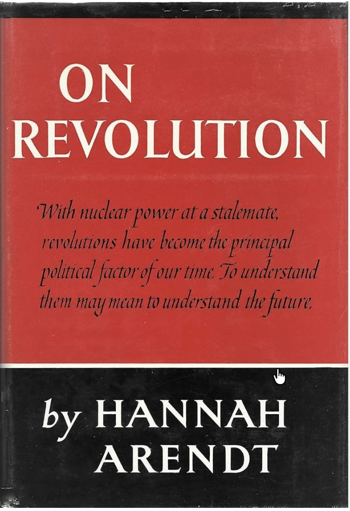

<!-- _class: titlefix -->
<!-- _paginate: false -->

DBAP 611 · HANNAH ARENDT

Revolution, Power, and the Human Capacity to Begin

A reading of Chapter 1 of <em>On Revolution</em>

How Arendt reframes revolution as the founding of freedom through collective action — and why that makes her theory of power finally click.

Joe Hupp

Weatherhead School of Management · Case Western Reserve University

---

# Opening Story

Imagine a workplace where leadership suddenly disappears.

At first, you expect collapse.

Instead, people begin talking, organizing, and acting together.

So what are we actually seeing?

**Chaos — or power?**

---

# The Usual Misunderstanding

We often think revolution means:

- violence
- breakdown
- instability

Arendt asks us to see something deeper.

---

# Arendt’s Reframe

Revolution is not merely overthrow.

It is not just rebellion.

It is not simply the destruction of an old order.

**It is a beginning.**

---

# The Central Distinction

| Liberation | Freedom |
|---|---|
| freedom **from** oppression | freedom **to** participate |
| removal of domination | action in public life |
| necessary | the real political aim |

---

# Why That Matters

A society can achieve liberation and still fail to create freedom.

Removing oppression does not automatically create a world in which people can act together.

That is one of Arendt’s most important insights.

---

# The Capacity to Begin

What makes revolution significant is not just conflict.

It is the human capacity to begin something new.

Not restore.

Not repeat.

But **found**.

---

# Where Power Comes From

Power does not come from force.

Power does not come from control.

Power does not come from one person commanding others.

**Power comes from people acting together.**

---

# Violence Is Not Power

| Violence | Power |
|---|---|
| instrumental | relational |
| can coerce | requires participation |
| can destroy | can create |
| can be used alone | exists only among people |

---

<!-- _class: bookend -->

# Return to Power

Arendt’s earlier argument now comes into focus:

Power exists only while people act together.

It is not stored. It is not owned. It does not sit inside offices, titles, or institutions. It appears in the living moment of collective action — and disappears when that action dissolves.

---

<!-- _class: dark -->

# Synthesis

## Revolution  
### ↓  
## creates a public space  
### ↓  
## collective action  
### ↓  
## power  

### When participation breaks → violence

---

# Two Revolutionary Paths

| American Revolution | French Revolution |
|---|---|
| stronger emphasis on founding | overtaken by necessity |
| institution-building | social suffering becomes central |
| creation of political space | instability intensifies |
| closer to Arendt’s ideal of freedom | violence begins to replace power |

---

# The Bookend Clicks Here

At the start of the semester, Arendt’s idea of power may have sounded abstract.

*On Revolution* gives it historical form.

Revolution is not about **seizing** power.

It is about **creating the conditions in which power can exist**.

---

# Why This Still Matters

Arendt is not only helping us interpret revolutions.

She is helping us diagnose institutions.

We often confuse:

- control with power
- authority with legitimacy
- compliance with participation

---

# Application

If Arendt is right, many organizations are weaker than they appear.

A system may look stable because it is tightly controlled.

But if people are disengaged, silenced, or merely complying, then power may actually be thin.

---

# Closing Line

> Power is not something we hold.  
> It is something we create together.